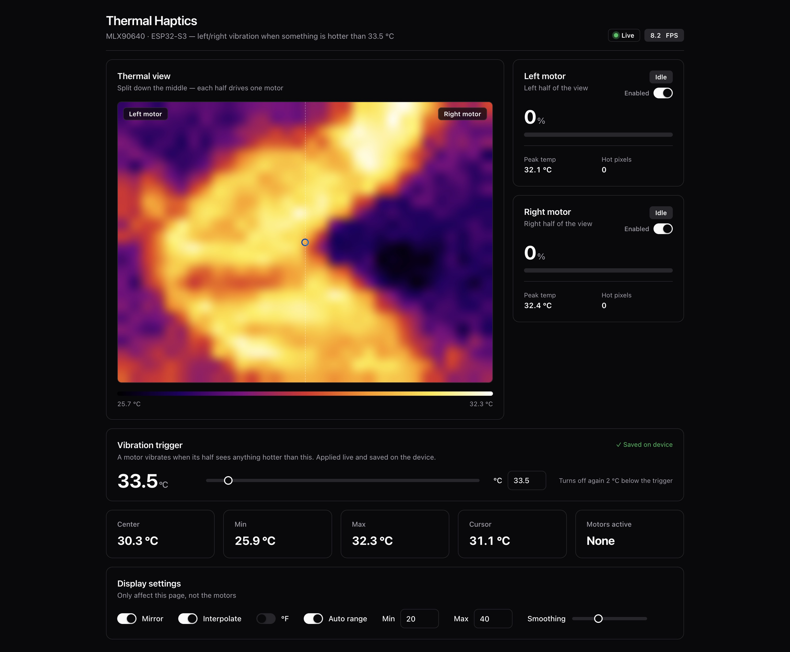

# ESP32-S3 Thermal Haptics



An ESP32-S3 with an MLX90640 thermal camera (32×24 pixels) that:

- Streams the live thermal image to a web dashboard.
- Splits the camera view down the middle and drives one **vibration motor per half**.
  When something in a half is hotter than the trigger temperature (50 °C by default,
  adjustable live), that side's motor vibrates. The closer the hot object, the stronger it vibrates.

## Features

- **Live thermal view**: iron color palette, interpolation, mirror, auto or manual range,
  temperature under the cursor, min/max/center readouts, and °C/°F.
- **Hot object boxes**: anything hotter than the trigger temperature gets a cyan box with its
  peak temperature and a dot on its hottest pixel, so hot objects are easy to spot. Touching
  hot pixels are grouped into one box; the hottest object's box is drawn thicker (up to 5 boxes).
- **Left/right haptics**: each half works on its own, so both motors can vibrate at once.
- **Proximity-scaled strength**: the camera can't measure distance, so closeness is estimated
  from two signs:
  - how big the hot spot looks: its apparent area grows about 1/distance², and the code uses √area;
  - how hot its peak reads: a far object gets averaged with the cooler background.

  Whichever sign is stronger sets the motor strength.
- **Hysteresis and smoothing**: a motor stops 2 °C below the trigger, so it doesn't flicker
  on and off at the edge.
- **Dashboard** in a shadcn-style UI:
  - per-motor cards with an Idle / Vibrating / Disabled badge, intensity %, peak temperature
    and hot-pixel count;
  - the half of the thermal view whose motor is vibrating is highlighted.
- **Live settings from the dashboard**, saved in flash so they survive a reboot:
  - vibration trigger temperature, 25–150 °C;
  - enable/disable each motor.
- **Startup self-test**: the left motor buzzes, then 1 s later the right one does, so you can
  check the wiring and which side is which.
- **Fail-safe**: both motors stop if the sensor stops sending frames for 500 ms.

## Hardware

| Part | Notes |
|---|---|
| ESP32-S3 dev board | Any ESP32-S3 board. |
| MLX90640 breakout | 55° or 110° FOV version. 3.3 V. |
| 2 × coin/ERM vibration motors | 3 V, ~60–100 mA each. |
| 2 × motor drivers | A "vibration motor module" (has its own transistor), **or** your own switch per motor (see below). |

## Wiring

### MLX90640 (I²C)

| MLX90640 | ESP32-S3 |
|---|---|
| VIN | 3V3 |
| GND | GND |
| SDA | GPIO 8 |
| SCL | GPIO 9 |

Keep the I²C wires short (under ~10–15 cm). The sensor runs at 1 MHz.

### Vibration motors

| Motor | ESP32-S3 pin |
|---|---|
| Left | GPIO 4 |
| Right | GPIO 5 |

> ⚠️ **Never connect a bare motor directly to a GPIO pin.** A motor draws 60–100 mA, while a GPIO pin
> can only supply a few tens of mA. A motor also sends a voltage spike back into the pin when it switches off.

**Option A: vibration motor module (easiest).** These modules already have a transistor and diode.

```
Module VCC -> 3V3 (or 5V)
Module GND -> GND
Module IN  -> GPIO 4 (left)  /  GPIO 5 (right)
```

**Option B: your own transistor switch (one per motor).**

```
 3V3 (or 5V) ──────┬───────────┐
                   │           │
                 Motor     Diode 1N4148 / 1N5819
                   │      (cathode/stripe to 3V3)
                   ├───────────┘
                   │
                 Drain / Collector
 GPIO 4/5 ──[1kΩ]── Gate / Base   (N-MOSFET e.g. AO3400, or NPN e.g. 2N2222 / S8050)
                 Source / Emitter
                   │
 GND ──────────────┘
```

- Use a logic-level N-MOSFET (one that switches fully on at 3.3 V), or an NPN transistor with a 1 kΩ base resistor.
- The flyback diode goes **across the motor**, with the stripe toward the + supply.
- The ESP32 GND and the motor supply GND must be connected.

### Pin summary

```
             ESP32-S3
          ┌────────────┐
   3V3 ───┤ 3V3        │
   GND ───┤ GND        │
 MLX SDA ─┤ GPIO 8     │
 MLX SCL ─┤ GPIO 9     │
 Motor L ─┤ GPIO 4     │  (through driver)
 Motor R ─┤ GPIO 5     │  (through driver)
          └────────────┘
```

All pins can be changed in the `User config` section of the sketch.

## Software setup

1. Install the **ESP32 board package** (Arduino-ESP32 core 2.x or 3.x both work) in the Arduino IDE.
2. Install these libraries from the Library Manager:
   - **Adafruit MLX90640** (and its dependency, Adafruit BusIO)
   - **WebSockets** by Markus Sattler (Links2004)
3. Open `esp32s3_mlx90640_web.ino` and set your Wi-Fi in `User config`:
   ```cpp
   const char* WIFI_SSID = "your-ssid";
   const char* WIFI_PASS = "your-password";
   ```
4. Select your ESP32-S3 board and upload.
5. Open the Serial Monitor at **115200** baud. You should see:
   - `Motor test: left` and `Motor test: right`, each with a buzz on the matching motor;
   - the IP address.
6. Open `http://<ip>/` or `http://thermal.local/`.
   - If Wi-Fi fails, the board starts its own access point named **`ESP32-Thermal`**. Connect to it and open `http://192.168.4.1/`.

## Using the dashboard

| Section | What it does |
|---|---|
| Header | Connection status (Live / Reconnecting), FPS, current trigger temperature. |
| Thermal view | Live image split down the middle. A half glows red, with the motor % on its label, while its motor vibrates. |
| Motor cards | Status badge, intensity %, peak temperature and hot-pixel count per half, and an **Enabled** switch. |
| Vibration trigger | Slider or number box (25–150 °C). Applied immediately and saved on the device. |
| Stats | Center, min, max, cursor temperature, and which motors are active. |
| Display settings | Mirror, interpolate, hot boxes, °F, auto range, smoothing. These only change the page, not the motors. |

## Configuration (`User config` in the sketch)

| Setting | Default | Meaning |
|---|---|---|
| `MOTOR_L_PIN` / `MOTOR_R_PIN` | 4 / 5 | Motor driver pins. |
| `MIRROR_VIEW` | `true` | Which camera half drives which motor. Flip this if the motors fire on the wrong sides. |
| `HOT_C_DEFAULT` | 50 °C | Trigger used until you change it on the dashboard. After that, the saved value is used. |
| `HOT_C_MIN` / `HOT_C_MAX` | 25 / 150 °C | Allowed range for the dashboard setting. |
| `HOT_HYSTERESIS_C` | 2 °C | How far below the trigger a motor turns off again. |
| `NEAR_PIXELS` | 96 | Hot pixels in one half that count as "right in front" (full strength). |
| `NEAR_TEMP_SPAN_C` | 70 °C | Peak this far above the trigger also counts as full strength. |
| `MOTOR_MIN_DUTY` | 90 / 255 | Weakest PWM level. Raise it if your motor doesn't start at low levels. |
| `MOTOR_PWM_FREQ` | 20 kHz | Motor PWM frequency, above hearing range. |
| `MOTOR_TIMEOUT_MS` | 500 | Motors stop if no sensor frames arrive for this long. |
| `SENSOR_RATE` | 16 Hz | Try `MLX90640_8_HZ` if you see I²C read errors. |

## How it works

```
 MLX90640 ──I²C──► sensorTask (core 0)
                     ├─ updateMotors(): split frame L/R → hot pixels + peak per half
                     │                 → closeness → PWM duty (LEDC, 20 kHz) → motors
                     └─ shared frame buffer
                                   │
 loop() (core 1) ◄─────────────────┘
   ├─ HTTP :80   → dashboard page, /frame (raw int16 frame)
   └─ WebSocket :81
        ├─► binary frame: 768 temps (°C×100) + [dutyL, dutyR, hotL, hotR,
        │                 peakL×100, peakR×100, mirror, trigger×100, enabled bits]
        └─◄ text commands: "thr:55.5"  set trigger °C
                           "en:0:1"    enable/disable motor (0 = left, 1 = right)
```

Settings are stored in flash (NVS namespace `haptics`, keys `hotC`, `enL` and `enR`).

## Troubleshooting

- **A motor doesn't buzz during the startup test**: check that motor's driver wiring, the
  shared GND, and the diode direction.
- **Motors fire on the wrong side**: flip `MIRROR_VIEW`, or swap the motor pins.
- **Hot object doesn't trigger**:
  - Check **Max** on the dashboard. The object must actually read above the trigger.
  - Far-away or small objects get averaged with the background, so move closer.
  - Shiny metal (stainless mugs, pots) reflects the room and reads cold.
  - The side of a cup is cooler than the liquid inside, so aim at the open surface.
- **Motor too weak at low levels**: raise `MOTOR_MIN_DUTY`.
- **`MLX90640 not found!`**: check the SDA/SCL pins, 3V3 power and wire length.
- **Read errors or low FPS**: use shorter wires, or set `SENSOR_RATE` to `MLX90640_8_HZ`.
